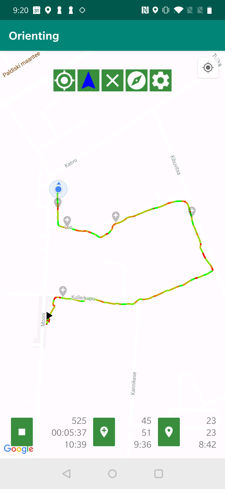
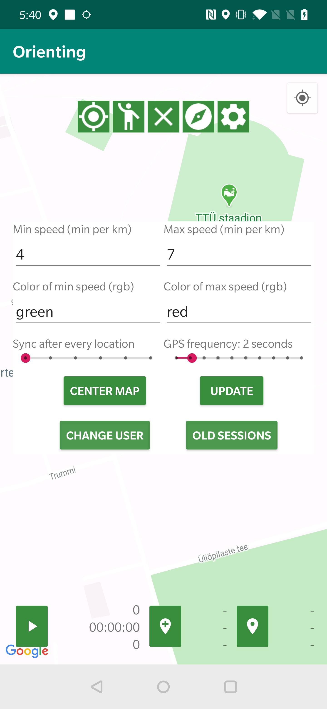
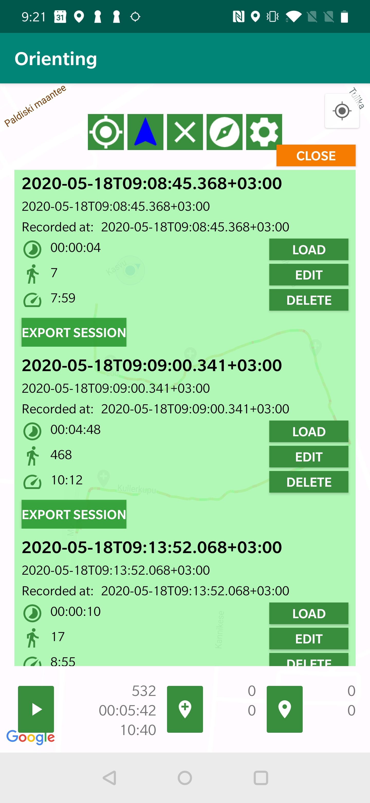
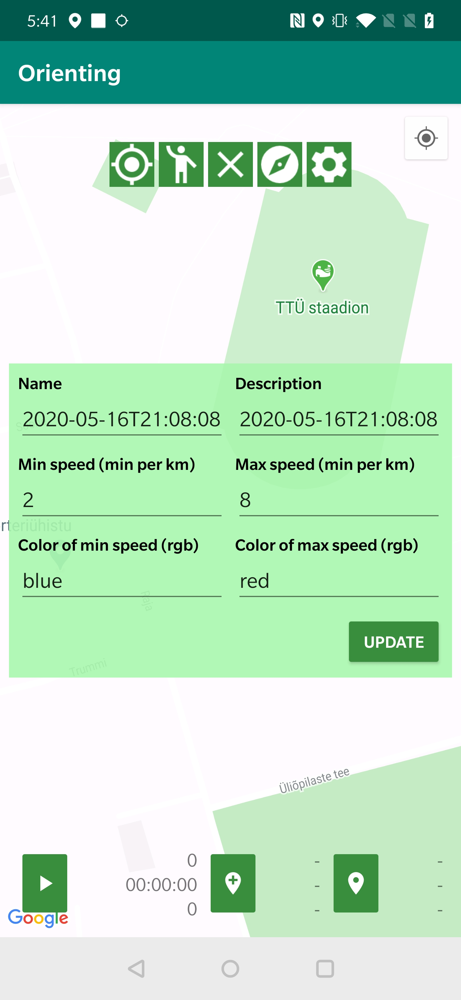
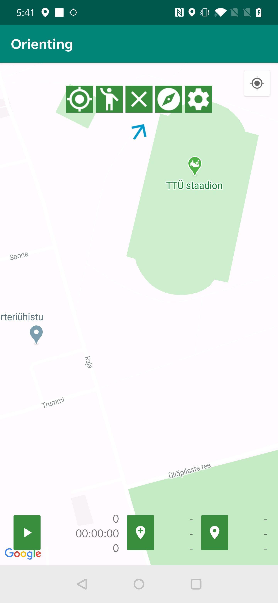
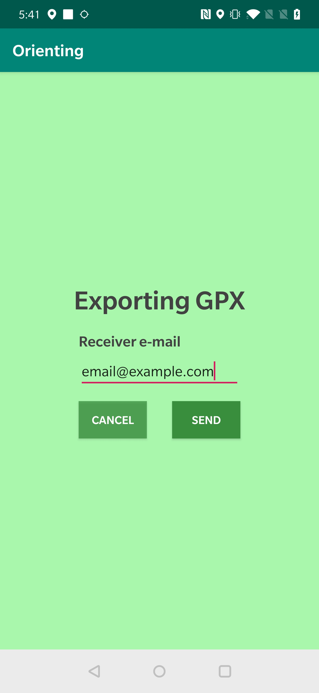
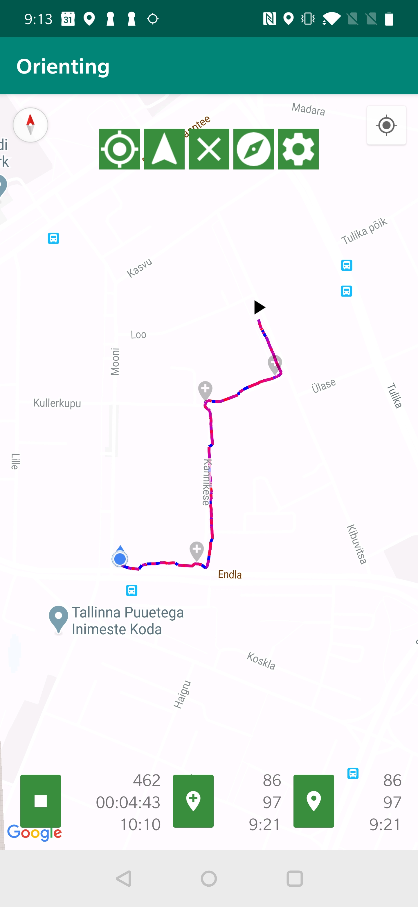

# Orienting application 
Platform Android 
Min SDK: 23 
Language: Kotlin 
DB: SQLite 
Current app version: 1.0 

| Track is drawn     | Change settings      |  Review old sessions      |  Edit old session     | 
|------------|-------------|-------------|-------------|
|  | | | |
|  Compass      |  Export session as GPX      |  Notification on lock screen     |   Control and way points can be added    | 
| | | |

 

v1.0 functionalities:
* Draw gradient polyline between recorded locations
* Change polyline colors between red, blue, green, black and white
* Add a way point
* Add control points, reset a way point when you do
* Keep local database and remote database in sync
* When offline, session will automatically sync when back online
* Watch statistics and add control points and way points also when screen is locked
* Load, edit and delete old sessions
* Change synchronization interval between remote database
* Change GPS location request frequency
* Map can be toggled centered so you wont have to drag on the map when you are running
* Map direction can be changed to User chosen up / Direction up / North up